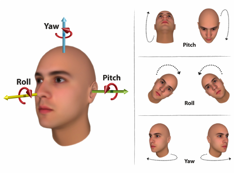
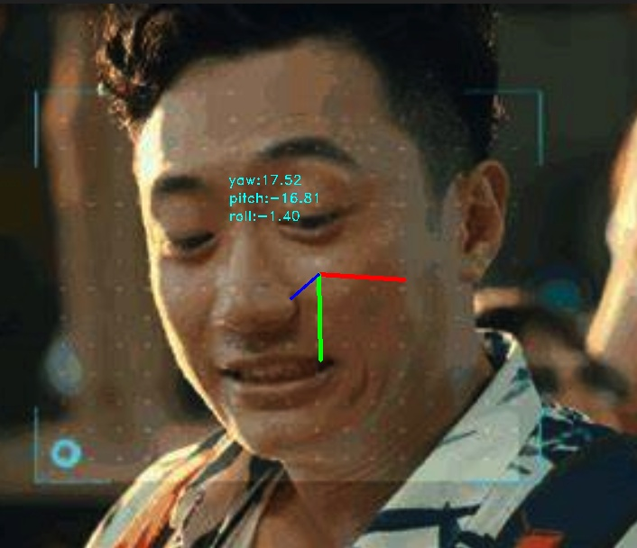

# HeadPoseEstimation

### 项目介绍
头部姿态估计
为了在端侧芯片部署制作的一个轻量化版本（基于mobilenetv2，不仅头部姿态估计，人脸检测也基于mobilenetv2做了轻量化改造)，均提供了onnx文件。
如果为了得到效果更好的版本，可以修改网络以及使用更多的数据（当前版本仅使用了biwi这一个数据集）。





**数据集**
BIWI
**模型**
HopeNet

**权重文件**    
头部姿态估计
>./weights/retinaface_mbv2_s840_fixfpn_relu_no_postproc_20210630.onnx

**人脸检测**
>./weights/head_pose_estimation_hopenet_biwi_mbv2_20211223.onnx

### 推理方式    
```
from deploy.head_pose_est_api import HeadPoseEstAPI

hpe_api = HeadPoseEstAPI(model_path='./weights/head_pose_estimation_hopenet_biwi_mbv2_20211223.onnx')
result = hpe_api(face_img)
```
具体可以参照 deploy/head_pose_est_api.py中的实现。
如果希望使用本地摄像头处理视频流，也可以使用run/realtime_time.py的代码。


### 训练代码    
1. 在代码中配置好biwi_dataset的文件路径
2. cd run & python3 train_mbv2_v3.py


**关于数据增强可以在如下代码中调节**         
增强方法包含：随机翻转、裁剪or扩展、旋转、畸变、色彩、亮度、模糊、Mixup、锐化等。
```
class Pipeline(object):
    def __init__(self):
        super(Pipeline, self).__init__()
        self.random_flip = RandomFlip(flip_ratio=0.5, direction='horizontal')
        self.random_crop = RandomCrop(crop_ratio=[0.6, 0.9])
        self.add_noise = AddNoise()
        self.random_effect = RandomEffect()
        self.random_effect2 = RandomEffect2()
        self.rotate_func = Rotate()

        # self.mixup_func = MixUp()
        expand_params = dict(expand_ratio=[1.01, 1.2])
        mosaic_params = dict(mosaic_weight=0.1, base=224)
        self.expand_func = Expand(**expand_params)
        self.mosaic_func = Mosaic(**mosaic_params)
        self.sharpen_func = Sharpness()
```


### 优化点
当前没有项目涉及到这部分，所以不再进行更新，仅列举几点可以做的优化，有兴趣或者有需要的可以自行尝试。
1. more data for training
2. gradient accumulate
3. EMA
4. Optuna for DataAugmentation policy
5. loss function    


### 参考项目
1. https://github.com/Ascend-Research/HeadPoseEstimation-WHENet
2. https://github.com/natanielruiz/deep-head-pose
